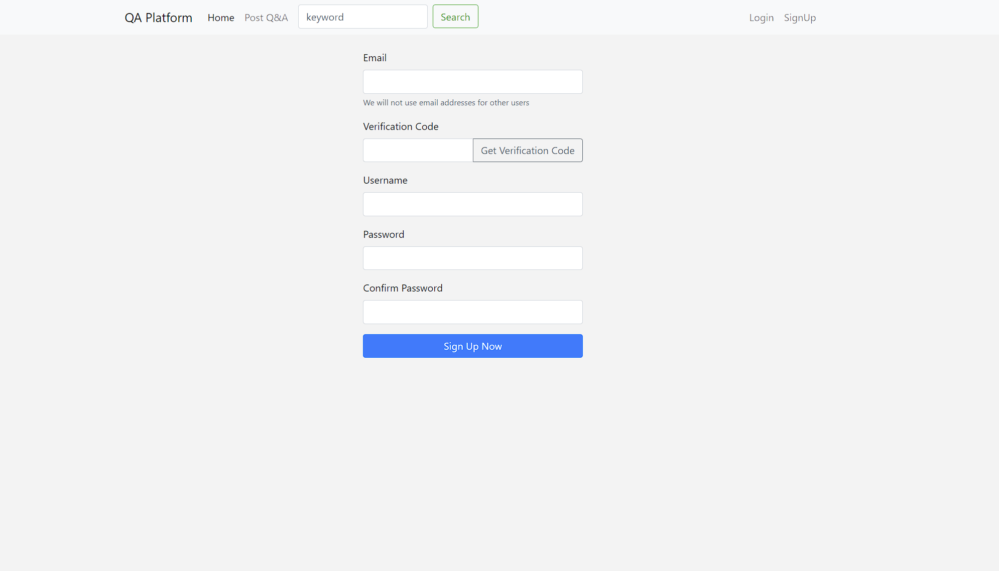
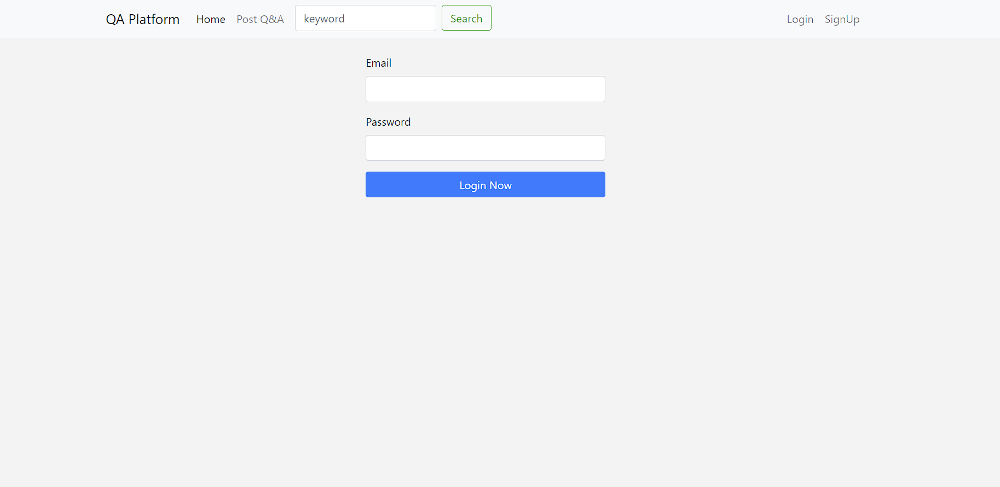
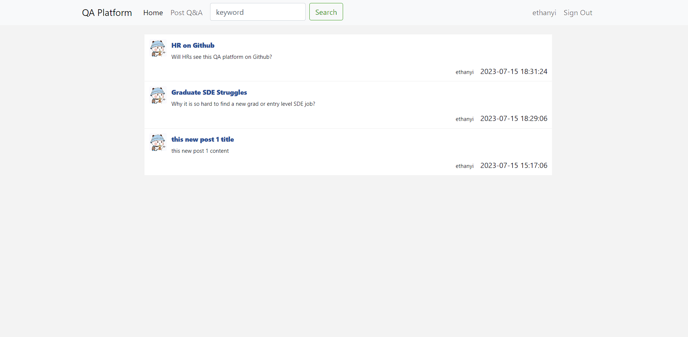
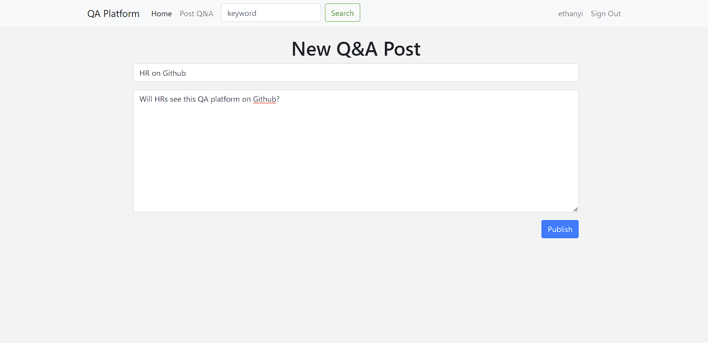
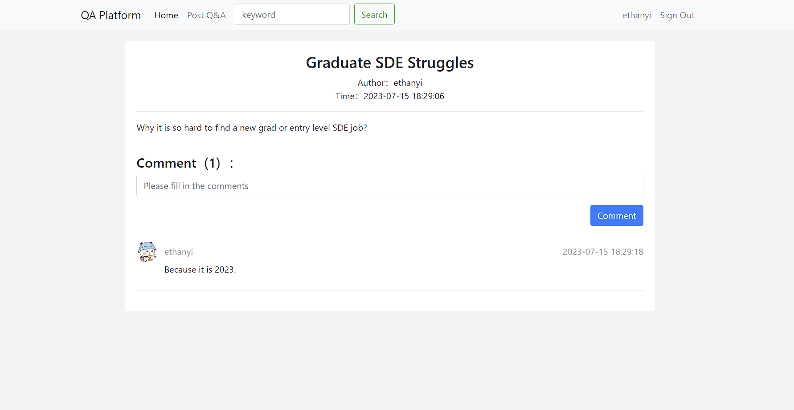

## Question-and-Answer Platform in Python+Flask

### Introduction:

A question-and-answer platform website where questions are displayed, asked and answered by users.

### Features:

1. Signup by email, email verification code, username and password.
     
2. Login by email and password.
   
3. Display all posts or search posts by keyword.
   
4. Publish a QA post.
   
5. Answer a QA post.
   

### Development Tools:

Python, Flask, SQLAlchemy, MySQL, MySQL Workbench, HTML/CSS, JavaScript, Ajax, jQuery, Bootstrap

### Run the Program:

Go to the project directory  
$ `flask --app app run`